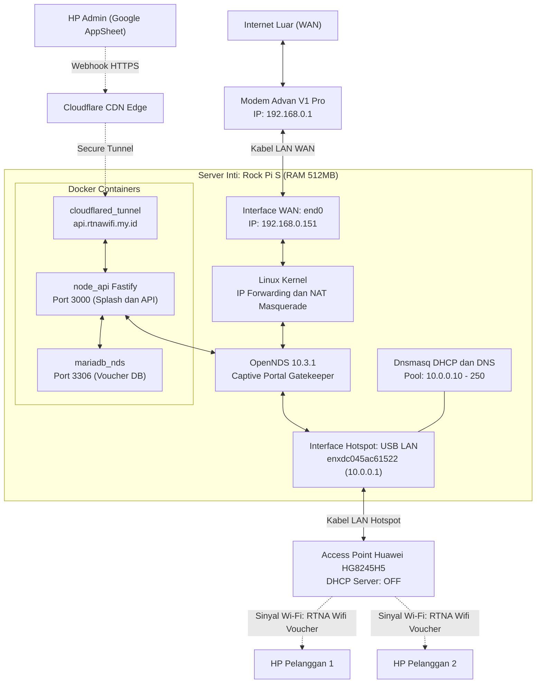
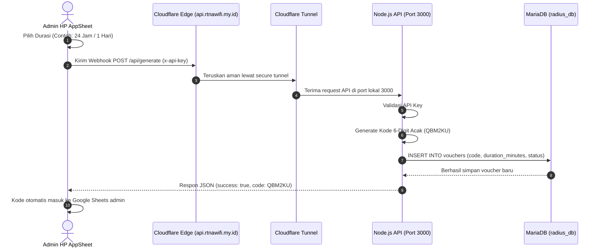
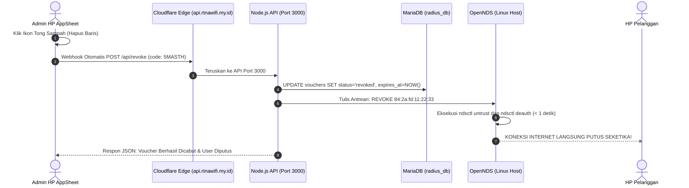
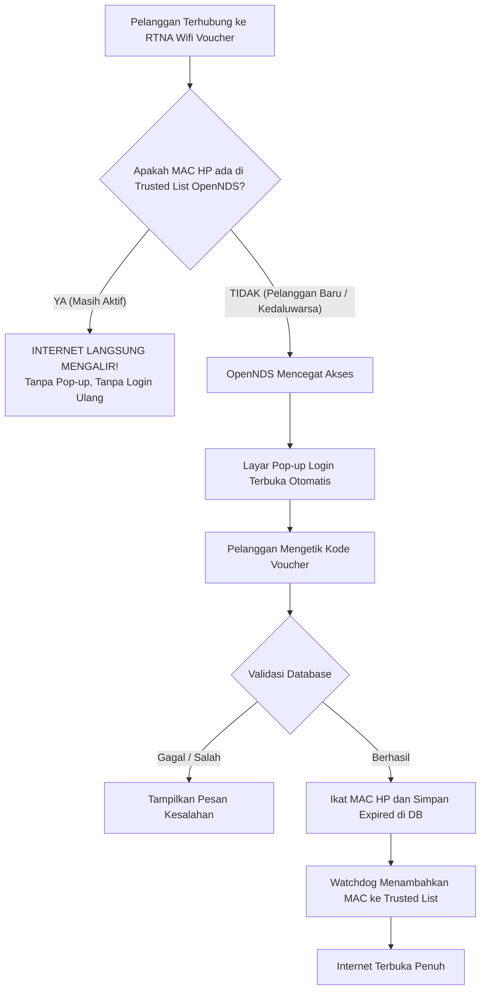
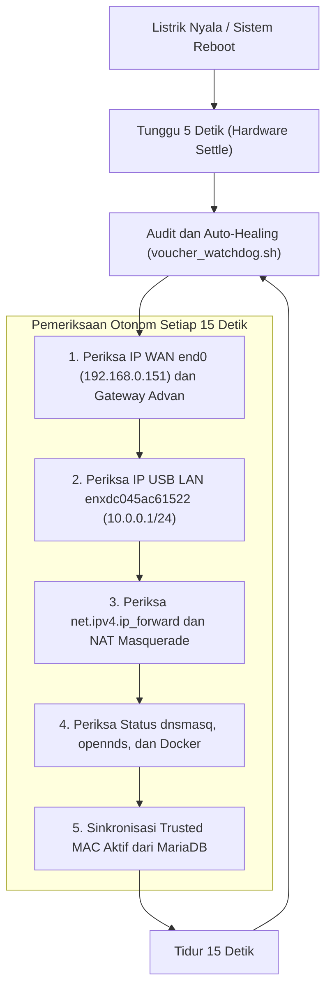

# MASTER SYSTEM DOCUMENTATION: RTNA WI-FI VOUCHER SYSTEM
**Arsitektur Sistem Captive Portal Mandiri Berbasis Single Board Computer (Rock Pi S)**  
*Dokumen Panduan Teknis & Manual Operasional Komprehensif (Versi 2.0 - Final Edition)*

> "Salam Hangat dari Bintaro - Indonesia"  
> [@JuraganMuda](https://www.instagram.com/juraganmuda/) | IG

---

## DAFTAR ISI
1. [Visi & Filosofi Desain Sistem](#1-visi--filosofi-desain-sistem)
2. [Topologi Jaringan & Perangkat Keras (Hardware Layer)](#2-topologi-jaringan--perangkat-keras-hardware-layer)
3. [Konfigurasi Sistem Operasi & Jaringan Inti (OS & Network Layer)](#3-konfigurasi-sistem-operasi--jaringan-inti-os--network-layer)
4. [Tumpukan Perangkat Lunak & Ekosistem Docker (Software Stack Layer)](#4-tumpukan-perangkat-lunak--ekosistem-docker-software-stack-layer)
5. [Alur Manajemen Voucher: Pendekatan API-First & AppSheet (Admin Flow)](#5-alur-manajemen-voucher-pendekatan-api-first--appsheet-admin-flow)
6. [Alur Pengalaman Pengguna (Customer User Flow) & Zero-Touch MAC Trust](#6-alur-pengalaman-pengguna-customer-user-flow--zero-touch-mac-trust)
7. [Ketahanan Pemadaman Listrik & Auto-Healing Watchdog (PLN-Proof)](#7-ketahanan-pemadaman-listrik--auto-healing-watchdog-pln-proof)
8. [Lembar Perintah Cepat & Prosedur Pemeliharaan (Operational Cheatsheet)](#8-lembar-perintah-cepat--prosedur-pemeliharaan-operational-cheatsheet)
9. [Kesimpulan & Penutup](#9-kesimpulan--penutup)

---

## 1. Visi & Filosofi Desain Sistem

Sistem **RTNA Wi-Fi Voucher** dirancang khusus untuk menyediakan layanan internet komersial skala mikro (RT/RW Net / kos-kosan / lingkungan tetangga) yang beroperasi di atas perangkat keras hemat daya (*ultra-low power*). 

Sistem ini dibangun dengan 3 prinsip rekayasa utama:
1. **Zero-Touch Customer Experience (Tanpa Beban Pelanggan):** Pelanggan tidak boleh dipersulit dengan keharusan mencatat kode, mengatur IP statis, atau mengetik ulang voucher saat keluar-masuk rumah atau saat HP mati. Sekali voucher aktif, perangkat pelanggan otomatis diikat (*Auto-Trust MAC*) sampai durasi waktu sewa habis.
2. **Extreme Memory & Resource Efficiency (Alokasi RAM Minimalis):** Rock Pi S hanya memiliki RAM 512MB. Sistem tidak menggunakan panel web GUI berat atau web server Apache/Nginx terpisah. Setiap kontainer Docker dibatasi kuota RAM ketat menggunakan alokasi kernel cgroups.
3. **PLN-Proof & Self-Healing (Tahan Pemadaman Listrik 24/7):** Sistem tidak boleh membutuhkan campur tangan laptop atau admin saat listrik padam dan menyala kembali. Semua interface jaringan, routing NAT, firewall, DHCP, database, dan session pelanggan langsung pulih secara otomatis dalam hitungan detik setelah tegangan listrik kembali normal.

---

## 2. Topologi Jaringan & Perangkat Keras (Hardware Layer)

### A. Inventaris Perangkat Keras & Spesifikasi OS
| Perangkat | Tipe / Model | Peran dalam Arsitektur | Konfigurasi Utama |
| :--- | :--- | :--- | :--- |
| **Sumber Internet (WAN)** | Advan V1 Pro (CPE 4G Modem Router) | Gerbang Internet Utama (Uplink) | IP Gateway: `192.168.0.1/24`<br/>Menyediakan akses internet pita lebar |
| **Server Inti (Billing & Router)** | Rock Pi S V1.3 (SoC RK3308, ARM64, RAM 512MB) | Router, Firewall, DHCP Server, Auth Controller, Database & API Server | **OS:** [Armbian v26.8.1 (Kernel 6.18.43 CLI)](https://www.armbian.com/rockpi-s/)<br/>**Port end0 (WAN):** IP Statis `192.168.0.151/24`<br/>**Port USB LAN (Hotspot):** IP Statis `10.0.0.1/24` |
| **Adaptor LAN Tambahan** | USB to Ethernet 10/100 Dongle (QinHeng Electronics) | Antarmuka Fisik Hotspot Voucher (`enxdc045ac61522`) | Terhubung ke port USB Type-A Rock Pi S, mengalirkan segmen voucher `10.0.0.0/24` |
| **Access Point (Pemancar)** | Huawei HG8245H5 / Outdoor AP | Pemancar Sinyal Nirkabel (*Bridge Mode*) | **DHCP Server: DISABLED (OFF)**<br/>Meneruskan trafik Wi-Fi mentah langsung ke Rock Pi S |

### B. Diagram Topologi Jaringan



### C. Alokasi Skema Pengalamatan IP (IP Addressing Scheme)
- **Segmen Jaringan WAN (Rumah / Server Uplink):**
  - Subnet: `192.168.0.0/24`
  - Gateway Advan: `192.168.0.1`
  - Rock Pi S `end0`: `192.168.0.151`
- **Segmen Jaringan Hotspot (Pelanggan Voucher):**
  - Subnet: `10.0.0.0/24`
  - Gateway / Host Server: `10.0.0.1`
  - DHCP Range Pelanggan: `10.0.0.10` s/d `10.0.0.250`
  - Subnet Mask: `255.255.255.0`
  - DNS Server: `10.0.0.1` (diteruskan ke `8.8.8.8` & `1.1.1.1`)

---

## 3. Konfigurasi Sistem Operasi & Jaringan Inti (OS & Network Layer)

Sistem operasi yang diwajibkan adalah **[Armbian v26.8.1 (Ubuntu 26.04 CLI / Headless Minimal)](https://www.armbian.com/rockpi-s/)** dengan Kernel Linux modern **`6.18.43-current-rockchip64`** berarsitektur 64-bit (`aarch64`).

> [!CAUTION]
> **Larangan Varian Desktop (GUI):**  
> Dengan total RAM fisik hanya 512MB, sistem **hanya boleh menggunakan varian CLI/Minimal/Server**. Penggunaan varian Desktop (XFCE/GNOME) akan menghabiskan lebih dari 70% kapasitas RAM dan memicu *freeze* atau kepanikan memori kernel saat Docker dijalankan.

### A. Swap Memory 1GB (Pencegahan Out-of-Memory / OOM)
Dengan kapasitas RAM fisik 512MB, menjalankan Docker engine, MariaDB, Node.js, Cloudflare Tunnel, dan OpenNDS secara bersamaan memiliki risiko memicu *Linux Out of Memory Killer* jika terjadi lonjakan trafik.
- **Perintah Pembuatan Swapfile 1GB:**
  ```bash
  fallocate -l 1G /swapfile
  chmod 600 /swapfile
  mkswap /swapfile
  swapon /swapfile
  echo '/swapfile none swap sw 0 0' >> /etc/fstab
  ```
- **Swappiness:** Ditetapkan ke nilai konservatif (`vm.swappiness=20`) agar sistem lebih memprioritaskan RAM fisik dan hanya menggunakan swap saat memori benar-benar terdesak, sehingga memperpanjang umur memori eMMC/SD Card.

### B. DHCP Server & DNS Relay (dnsmasq)
Layanan `dnsmasq` dipilih karena sangat ringan (< 5MB RAM) dan cepat.
- File konfigurasi: `/etc/dnsmasq.d/voucher.conf`
```ini
bind-dynamic
interface=enxdc045ac61522
dhcp-range=10.0.0.10,10.0.0.250,255.255.255.0,12h
dhcp-option=3,10.0.0.1
dhcp-option=6,10.0.0.1
server=8.8.8.8
server=1.1.1.1
```
> [!IMPORTANT]
> **Penggunaan `bind-dynamic`:** Menggantikan konfigurasi lama `bind-interfaces` yang kaku. Dengan `bind-dynamic`, dnsmasq tidak akan crash apabila dongle USB LAN terlambat diinisialisasi kernel saat sistem boot ulang.

### C. Kernel Packet Forwarding & NAT Masquerade (iptables)
Agar paket data dari segmen voucher (`10.0.0.0/24`) dapat diteruskan ke internet melalui modem Advan (`end0`), fitur perutean kernel Linux diaktifkan:
1. **Sysctl IP Forward:**  
   File: `/etc/sysctl.d/99-voucher.conf`
   ```ini
   net.ipv4.ip_forward=1
   ```
2. **Firewall NAT Masquerading:**
   ```bash
   iptables -t nat -A POSTROUTING -o end0 -j MASQUERADE
   ```
   Aturan disimpan secara persisten menggunakan `netfilter-persistent` (`/etc/iptables/rules.v4`).

### D. Konfigurasi Antarmuka Permanen (systemd-networkd & Netplan)
Untuk mencegah IP bawaan lama (`192.168.100.2`) muncul kembali, konfigurasi diatur secara hierarkis:
1. `/etc/systemd/network/10-end0.network`:
   ```ini
   [Match]
   Name=end0

   [Network]
   Address=192.168.0.151/24
   Gateway=192.168.0.1
   DNS=8.8.8.8
   DNS=192.168.0.1
   ```
2. `/etc/systemd/network/05-voucher.network`:
   ```ini
   [Match]
   Name=enxdc045ac61522

   [Network]
   Address=10.0.0.1/24
   LinkLocalAddressing=no
   IPv6AcceptRA=no
   ```

---

## 4. Tumpukan Perangkat Lunak & Ekosistem Docker (Software Stack Layer)

Seluruh komponen aplikasi dibungkus dalam kontainer Docker dengan isolasi batas memori (*Resource Limits*) ketat:

### A. Matriks Alokasi Sumber Daya Memori (RAM Budgeting)
| Service / Kontainer | Basis Teknologi | Alokasi RAM Maksimal | Peran & Tanggung Jawab |
| :--- | :--- | :--- | :--- |
| **mariadb_nds** | MariaDB 10.11 Alpine | **150 MB** | Penyimpanan tabel voucher & riwayat MAC pelanggan |
| **node_api** | Node.js 20 Alpine (Fastify) | **100 MB** | Otak logika sistem: API Webhook, validasi voucher, dan penyedia Splash Page |
| **cloudflared_tunnel** | Cloudflare Tunnel Core | **50 MB** | Jalur terowongan aman dari internet publik ke port lokal 3000 |
| **opennds & OS Native** | OpenNDS 10.3.1 C Native + Linux Kernel | **~100 MB** | Kontrol paket iptables, pencegatan port 80/443, autentikasi |
| **Buffer & Cadangan OS** | Armbian Linux System | **~112 MB** (+ 1GB Swap) | Stabilitas kernel dan filesystem cache |
| **TOTAL** | — | **512 MB** | **Optimal 100% tanpa risiko kehabisan memori** |

### B. OpenNDS sebagai Controller Captive Portal (FAS Murni)
OpenNDS berjalan secara *native* di Linux (bukan di dalam Docker) untuk efisiensi manipulasi iptables kernel.
- **Mode FAS (Forwarding Authentication Service):** OpenNDS tidak menampilkan halaman login bawaan yang kaku, melainkan mengalihkan (*HTTP 302 Redirect*) peramban klien ke backend Node.js Fastify di `http://10.0.0.1:3000/`.
- File: `/etc/opennds/opennds.conf`
  ```ini
  GatewayInterface enxdc045ac61522
  sessiontimeout 0
  authidletimeout 0

  login_option_enabled 1
  fasport 3000
  faspath /
  fasremoteip 10.0.0.1
  fas_secure_enabled 0
  ```
> [!NOTE]
> Nilai `sessiontimeout 0` dan `authidletimeout 0` memastikan OpenNDS tidak memutus koneksi pelanggan secara sepihak di tengah jalan. Kontrol kedaluwarsa sepenuhnya dipegang oleh database.

### C. Node.js Fastify (Dual-Purpose: API + Static Server)
Dibandingkan Express.js atau tumpukan Nginx + PHP, Fastify dipilih karena memiliki konsumsi memori 60% lebih rendah dan latensi *routing* tercepat di dunia Node.js.
- **Arsitektur Dual-Function:**
  1. **Serving Frontend:** Menggunakan plugin `@fastify/static` untuk menyajikan berkas *Splash Page* interaktif modern (`public/index.html`) langsung di port 3000 tanpa membutuhkan Nginx sebagai perantara.
  2. **Serving Backend API:** Menangani *endpoint* pembuatan voucher untuk AppSheet (`/api/generate`) dan *endpoint* login klien (`/api/login`).
- **Network Mode:** Dijalankan dengan `network_mode: "host"` di `docker-compose.yml` agar dapat langsung membaca tabel ARP Linux (`/proc/net/arp`) untuk membaca MAC address perangkat klien secara instan.

### D. MariaDB Alpine & Skema Basis Data
Database dirancang ringkas dengan satu tabel utama yang memiliki performa baca kilat:
```sql
CREATE TABLE IF NOT EXISTS vouchers (
  id INT AUTO_INCREMENT PRIMARY KEY,
  code VARCHAR(10) NOT NULL UNIQUE,
  duration_minutes INT NOT NULL,
  status ENUM('active', 'used', 'expired') DEFAULT 'active',
  mac VARCHAR(17) DEFAULT NULL,
  created_at TIMESTAMP DEFAULT CURRENT_TIMESTAMP,
  expires_at TIMESTAMP NULL DEFAULT NULL,
  INDEX idx_code (code),
  INDEX idx_mac (mac)
) ENGINE=InnoDB DEFAULT CHARSET=utf8mb4;
```

### E. Penguncian Proyek & Volume Database (Folder-Independent Locking)
Secara bawaan (*default*), Docker Compose menggunakan nama direktori kerja sebagai nama proyek dan awalan nama volume penyimpanan data (`<nama_folder>_<nama_volume>`). Mekanisme bawaan tersebut rentan memicu pembuatan volume baru yang kosong apabila pengguna atau pengembang mengganti nama folder proyek di kemudian hari.

Untuk menjamin integritas dan kekebalan data terhadap perubahan struktur direktori, sistem menerapkan **Explicit Project & Volume Name Locking** pada `docker-compose.yml`:
1. **Explicit Project Name:** Mengunci `name: rockpis-wifivoucher` pada baris utama berkas Compose.
2. **Explicit Volume Name:** Mengunci nama volume database secara absolut:
   ```yaml
   volumes:
     db_data:
       name: rockpis_voucher_db_data
   ```

> [!IMPORTANT]
> **Kekebalan Perubahan Nama Folder (Portabilitas Penuh):**  
> Berkat penguncian ini, pengguna atau administrator bebas mengubah nama folder proyek kapan pun (misalnya `/root/rockpis-wifivoucher`, `/root/hotspot`, dsb.) di sistem host mana pun tanpa risiko data voucher terputus atau ter-reset. Docker Compose akan selalu mengenali dan menautkan kontainer MariaDB ke volume persisten `rockpis_voucher_db_data`.

### F. Cloudflare Tunnel (Inbound Access Tanpa Port Forwarding)
- Menghubungkan domain publik `api.rtnawifi.my.id` langsung ke port 3000 di dalam Rock Pi S.
- Bebas dari kebutuhan IP Publik Statis, DDNS, ataupun pembukaan port di router Advan (bebas blokir CGNAT provider seluler).

---

## 5. Alur Manajemen Voucher: Pendekatan API-First & AppSheet (Admin Flow)

Demi menjaga ketersediaan RAM 512MB, sistem **tidak memiliki panel dashboard admin lokal** di Rock Pi S. Seluruh manajemen voucher dikendalikan dari aplikasi seluler Google AppSheet di HP admin.



### A. Format Standar Pembuatan Voucher (POST /api/generate)
- **URL:** `https://api.rtnawifi.my.id/api/generate`
- **Method:** `POST`
- **Headers:** `x-api-key: rahasia-appsheet-123`
- **Body JSON:**
  ```json
  {
    "Status": "24 Jam/1 Hari",
    "Assignee": "VIKSA"
  }
  ```
- **Karakter Kode Voucher:** Dibuat menggunakan alfabet khusus (`ABCDEFGHJKLMNPQRSTUVWXYZ23456789`) tanpa karakter membingungkan seperti angka `0`, huruf `O`, angka `1`, dan huruf `I`.
- **Pencatatan Nama Pelanggan:** Nilai `Assignee` atau `Title` otomatis disimpan ke dalam kolom `customer_name` di database agar tampil di Live Monitor.

---

### B. Alur Penghapusan & Pemutusan Instan (Webhook POST /api/revoke)

Untuk mengatasi kelemahan di mana voucher yang dihapus di AppSheet penggunanya masih tetap bisa internetan, sistem kini dilengkapi dengan endpoint **Instant Revoke & Deauth**:



#### Panduan Konfigurasi Webhook Hapus di Google AppSheet:
1. Buka aplikasi Anda di [Google AppSheet Editor](https://www.appsheet.com/).
2. Masuk ke menu **Core** / **Automation** &rarr; **Bots**.
3. Buat Bot baru: **"Voucher Deleted Revoke"**.
4. Atur **Event**:
   - **Event Type:** `Data Change`
   - **Data Change Type:** Pilih **`Deletes only`**
   - **Table:** Pilih tabel voucher Anda (misal: `Table 1`).
5. Atur **Step (Run a task)**:
   - **Task type:** `Call a webhook`
   - **Url:** `https://api.rtnawifi.my.id/api/revoke`
   - **HTTP Verb:** `POST`
   - **HTTP Headers:**
     - Key: `x-api-key`, Value: `rahasia-appsheet-123`
     - Key: `Content-Type`, Value: `application/json`
   - **Body JSON Template:**
     ```json
     {
       "code": "<<[Assignee]>>"
     }
     ```
     *(Ganti `[Assignee]` dengan nama kolom yang menyimpan kode voucher di lembar spreadsheet Anda jika berbeda).*
6. Simpan (**Save**). Sekarang, setiap kali Anda menghapus voucher dari AppSheet, pengguna terkait akan langsung terputus dari internet dalam waktu kurang dari 1 detik!

---

### C. Pusat Kendali & Live Monitoring Pengguna Aktif (Control Center)

Bagi pemilik jaringan, mengamati siapa saja yang sedang terhubung ke Wi-Fi saat ini sangat penting. Tersedia antarmuka **Live Monitoring Dashboard** berbasis web yang sangat ringan (< 150KB), hemat memori, responsif di ponsel (*mobile-first*), dan dapat diakses dari mana saja tanpa VPN:

- **Alamat URL:** `https://api.rtnawifi.my.id/admin` (atau `http://10.0.0.1:3000/admin` jika terhubung ke hotspot lokal)
- **Keamanan:** Dilindungi **PIN Admin** (Default: `123456`, dapat diubah via environment `ADMIN_PIN`).

```text
┌────────────────────────────────────────────────────────────────────────┐
│ RTNA WI-FI CONTROL & LIVE MONITOR 🟢 LIVE (Auto 5s)                   │
├──────────────┬──────────────┬──────────────┬───────────────────────────┤
│ ONLINE: 3    │ DIGUNAKAN: 5 │ SIAP PAKAI: 8│ HABIS/DICABUT: 12         │
├──────────────┴──────────────┴──────────────┴───────────────────────────┤
│ [🔍 Cari Nama/Kode/IP/MAC...]  [Semua] [🟢 Online] [⏳ Sesi Aktif]     │
├──────────────┬──────────────┬──────────────┬──────────────┬────────────┤
│ PELANGGAN    │ KODE VOUCHER │ IP & MAC     │ SISA WAKTU   │ AKSI CEPAT │
├──────────────┼──────────────┼──────────────┼──────────────┼────────────┤
│ VIKSA        │ 5MASTH       │ 10.0.0.45    │ 6h 18j 22m   │ [🛑 Kick]  │
│ 🟢 Online    │              │ 84:2a:fd:... │ (Countdown)  │ [🗑️ Hapus] │
└──────────────┴──────────────┴──────────────┴──────────────┴────────────┘
```

#### Fitur Utama Live Monitoring Dashboard:
1. **🟢 Real-Time Online Detection:** Mendeteksi perangkat yang benar-benar aktif memancarkan paket data di jaringan dengan indikator lampu hijau berkedip.
2. **⏳ Dynamic Countdown Timer:** Jam dan menit sisa sewa pelanggan berjalan mundur secara *real-time* detik demi detik langsung di layar HP admin.
3. **🛑 Tombol Putus Sesi (Kick):** Memutus koneksi perangkat pelanggan seketika lewat `ndsctl deauth` tanpa menghapus vouchernya (berguna jika koneksi pelanggan sedang macet atau ingin dipaksa otentikasi ulang).
4. **🗑️ Tombol Hapus & Blokir:** Mencabut voucher dari sistem dan langsung mengunci gerbang OpenNDS seketika (< 1 detik).
5. **➕ Buat Voucher Cepat:** Fitur darurat untuk meng-generate voucher langsung dari browser jika admin sedang tidak membuka AppSheet.

---

## 6. Alur Pengalaman Pengguna (Customer User Flow) & Zero-Touch MAC Trust

### A. Alur Login Pertama Kali (First-Time Login)
1. **Penyambungan Wi-Fi:** Pelanggan menyambungkan perangkat ke SSID **`RTNA Wifi Voucher`** yang dipancarkan oleh Huawei HG8245H5.
2. **Pemberian IP:** `dnsmasq` di Rock Pi S segera memberikan IP lokal kepada HP pelanggan (contoh: `10.0.0.79`).
3. **Pemicu Pop-up Otomatis (Captive Portal Detection):** HP pelanggan mengirimkan *probe* HTTP standar (`connectivitycheck.gstatic.com`). OpenNDS mencegatnya di port 80 dan mengalihkan layar HP ke Splash Page ungu modern di `http://10.0.0.1:3000/`.
4. **Input Voucher:** Pelanggan mengetik kode 6 digit (contoh: `QBM2KU`) lalu menekan **Hubungkan**.
5. **Validasi & Pengikatan:** Backend Node.js memverifikasi ke MariaDB. Jika aktif, status diubah ke `used`, MAC Address HP pelanggan disimpan, dan batas waktu dihitung:
   $$\text{expires\_at} = \text{Waktu\_Sekarang} + \text{duration\_minutes}$$
6. **Buka Akses Internet:** OpenNDS menerima otentikasi token dan membuka firewall iptables. Internet langsung mengalir kencang ke HP pelanggan.

### B. Fitur Zero-Touch Auto-Trust (Bebas Login Ulang)
Kelemahan captive portal konvensional adalah pelanggan harus mengetik ulang kode jika sinyal terputus atau layar HP mati. Sistem RTNA menyelesaikan ini secara permanen:



- **Selama masa sewa masih berlaku (contoh: 24 Jam):**
  - Pelanggan bebas mematikan Wi-Fi, mengunci HP, atau bepergian ke luar rumah.
  - Saat kembali dan tersambung ke Wi-Fi, internet **LANGSUNG AKTIF DETIK ITU JUGA**.
  - Tidak ada pesan "No Internet Access" dan tidak ada form login yang mengganggu.
- **Saat Waktu Sewa Habis:**
  - Watchdog secara otomatis mendeteksi status kedaluwarsa, mengeksekusi `ndsctl untrust <mac>`, dan mengunci gerbang kembali.

---

## 7. Ketahanan Pemadaman Listrik & Auto-Healing Watchdog (PLN-Proof)

### A. Masalah Kritis Saat Terjadi Pemadaman Listrik (Simulasi PLN Padam)
Saat listrik padam dan menyala kembali, beberapa perangkat keras mengalami *race condition* (adu cepat nyala):
1. Rock Pi S boot dalam ~20 detik, sedangkan dongle USB LAN dan router AP butuh waktu beberapa detik lebih lama untuk *handshake* fisik.
2. Jika layanan captive portal start sebelum interface siap, layanan akan crash.
3. Alamat IP bisa hilang dan rute gateway internet bisa terputus.

### B. Solusi: Service Watchdog Otonom 24/7 (`voucher-watchdog.service`)
Untuk memastikan sistem 100% mandiri tanpa perlu diambilkan laptop atau diservis manual oleh admin, dipasang sebuah skrip pengawas cerdas berbobot ringan di `/usr/local/bin/voucher_watchdog.sh` yang dikontrol oleh `systemd`.



#### Tanggung Jawab Watchdog:
1. **Menjaga IP Statis WAN (`end0`):** Memastikan IP `192.168.0.151` dan rute default `192.168.0.1` selalu ada, serta membuang IP liar (seperti `192.168.100.2`).
2. **Menjaga IP Gateway Voucher (`enxdc045ac61522`):** Memastikan interface USB LAN selalu mengikat IP `10.0.0.1/24`.
3. **Memelihara NAT & Kernel Routing:** Menjamin `net.ipv4.ip_forward=1` dan iptables MASQUERADE selalu terpasang.
4. **Memulihkan Layanan (Auto-Restart):** Jika `dnsmasq`, `opennds`, atau kontainer Docker mati mendadak, watchdog langsung menghidupkannya kembali.
5. **Memulihkan Sesi Pelanggan Pasca-Mati Lampu:** Watchdog membaca database MariaDB yang tersimpan permanen di disk eMMC/SD Card. Semua pelanggan yang masih memiliki sisa waktu sewa langsung dimasukkan kembali ke daftar `Trusted MAC`. Pelanggan di rumah tidak merasakan gangguan dan tidak perlu memasukkan voucher ulang setelah lampu menyala.

---

## 8. Lembar Perintah Cepat & Prosedur Pemeliharaan (Operational Cheatsheet)

Jika sewaktu-waktu Anda ingin memeriksa kondisi kesehatan sistem dari terminal komputer Anda (`ssh root@192.168.0.151`):

### A. Diagnostik Jaringan & Captive Portal
| Kebutuhan | Perintah Terminal | Keterangan Output Normal |
| :--- | :--- | :--- |
| **Cek Status Captive Portal** | `ndsctl status` | Menampilkan versi, status upstream gateway (`online`), dan jumlah klien aktif |
| **Cek Daftar MAC yang Terbebas Login** | `ndsctl status \| grep -A 5 "Trusted MAC"` | Menampilkan daftar MAC pelanggan yang bebas akses tanpa voucher |
| **Cek Interface Jaringan** | `ip -br a` | `end0`: `192.168.0.151/24`<br/>`enxdc045ac61522`: `10.0.0.1/24` |
| **Tes Koneksi Internet Server** | `ping -c 3 8.8.8.8` | 0% packet loss, latensi ~30-40 ms |

### B. Diagnostik Docker & Basis Data
| Kebutuhan | Perintah Terminal |
| :--- | :--- |
| **Lihat Seluruh Kontainer** | `docker ps --format 'table {{.Names}}\t{{.Status}}\t{{.Ports}}'` |
| **Lihat Daftar Voucher di Database** | `docker exec mariadb_nds mysql -u radius -pradius_password radius_db -e "SELECT id, code, duration_minutes, status, mac, expires_at FROM vouchers ORDER BY id DESC LIMIT 10;"` |
| **Lihat Log Aktivitas Login Pelanggan** | `docker logs --tail 25 -f node_api` |
| **Lihat Log Terowongan Cloudflare** | `docker logs --tail 25 cloudflared_tunnel` |

### C. Kontrol Layanan Sistem (Systemd)
| Kebutuhan | Perintah Terminal |
| :--- | :--- |
| **Cek Status Watchdog 24/7** | `systemctl status voucher-watchdog.service` |
| **Restart Captive Portal** | `systemctl restart opennds` |
| **Restart DHCP Server** | `systemctl restart dnsmasq` |
| **Reboot Rock Pi S Aman** | `reboot` |

---

## 9. Kesimpulan & Penutup

Arsitektur **RTNA Wi-Fi Voucher** kini telah berdiri kokoh di atas fondasi perangkat keras Rock Pi S V1.3. Dengan integrasi cerdas antara perutean level kernel Linux, tumpukan kontainer Docker beranggaran memori presisi, Cloudflare Tunnel, Google AppSheet, serta sistem **Auto-Healing Watchdog 24/7**, sistem ini telah mencapai derajat **Production-Ready** untuk implementasi komersial nyata di lapangan. 

Infrastruktur ini tidak lagi rapuh terhadap pemadaman listrik, tidak membebani memori, dan memberikan kenyamanan mutlak bagi pelanggan Anda. Selamat atas terwujudnya arsitektur jaringan mandiri yang modern, elegan, dan tangguh! 🚀

---

> "Salam Hangat dari Bintaro - Indonesia"  
> [@JuraganMuda](https://www.instagram.com/juraganmuda/) | IG
